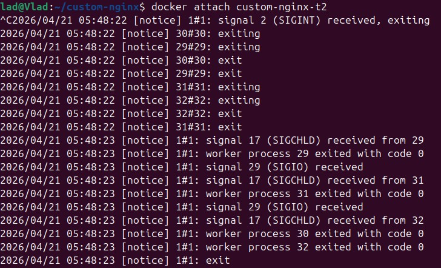
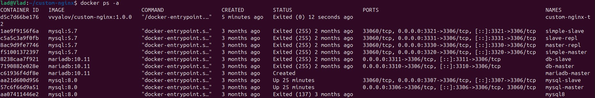
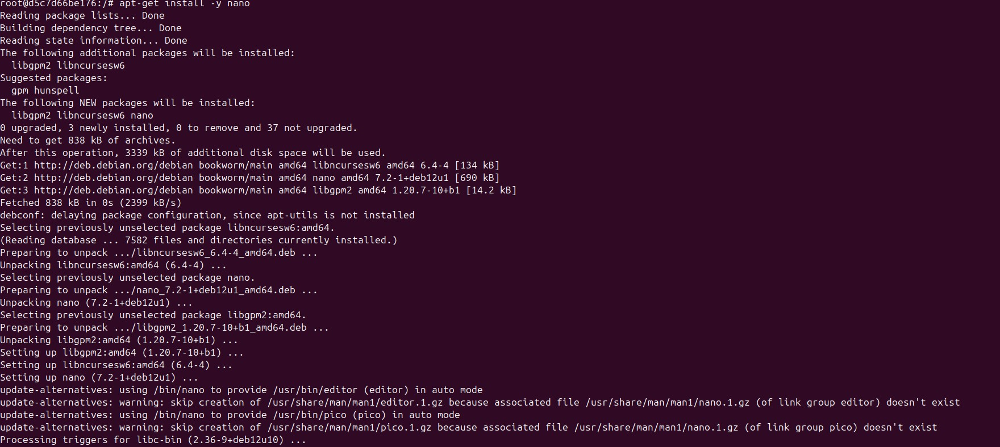
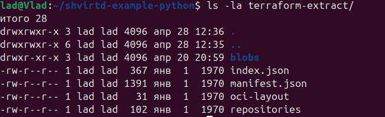
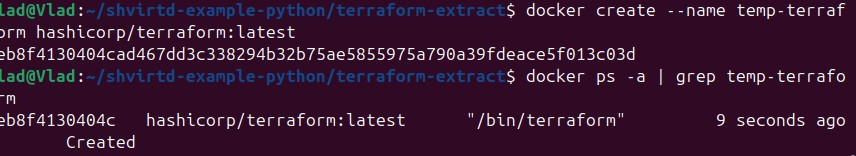

# Домашнее задание к занятию "Кеширование Redis/memcached" - `Вялов владислав`

### Задание 1

Приведите примеры проблем, которые может решить кеширование.

Ответ:

При помощи кэширования можно решить :

1. Медленное время ответа приложения так как кеширование готовых результатов ускоряет отдачу данных пользователю.
2. Повторяющиеся запросы если в процессе обработки запроса одни и те же данные используются многократно, их можно закешировать в памяти на время выполнения, чтобы не вычислять повторно, например повторяющиеся запросы к базе данных или внешним API кеширование результатов запросов позволяет сократить количество обращений к источнику, разгружая его.
3. Оптимизация работы с медленными дисками или устройствами хранения кеширование в оперативной памяти ускоряет чтение часто используемых данных, избегая обращений к медленным дискам.
4. Снижение сетевой задержки и затрат на передачу данных, для распределённых систем или систем с географически удалёнными пользователями кеширование на edge-серверах (CDN) уменьшает задержку и расходы на передачу данных через сеть.

### Задание 2

### Задание 3

Удаление по TTL в Memcached
Запишите в memcached несколько ключей с любыми именами и значениями, для которых выставлен TTL 5.

### Задание 4

Запишите в Redis несколько ключей с любыми именами и значениями.

Через redis-cli достаньте все записанные ключи и значения из базы, приведите скриншот этой операции.

