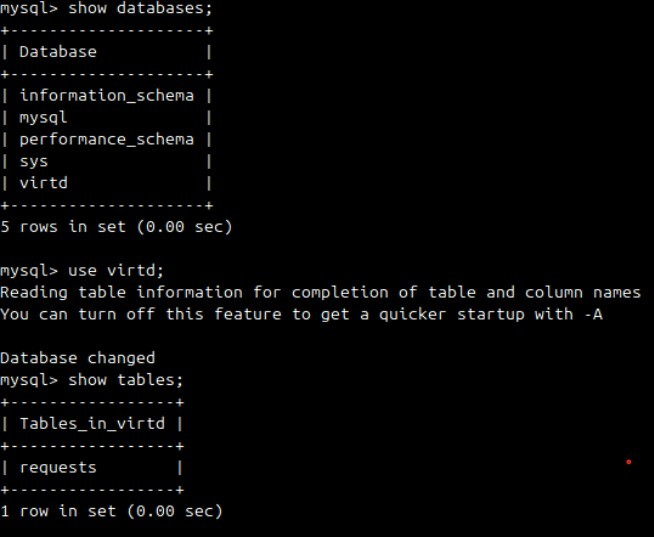
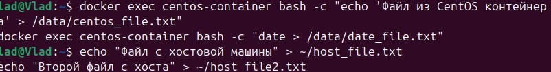
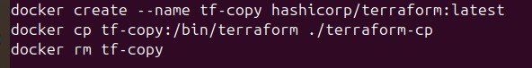
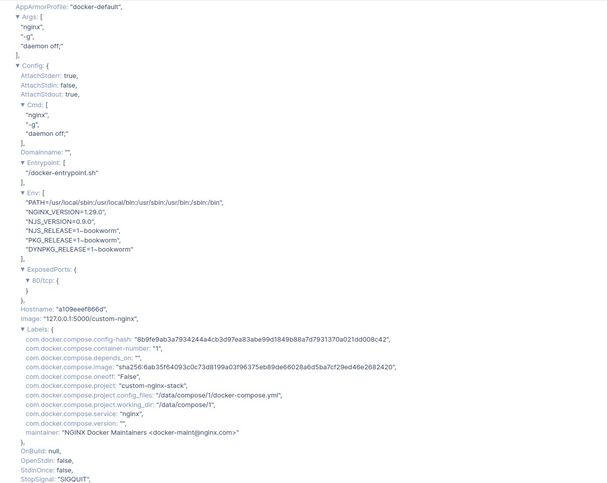

# Домашнее задание к занятию "Уязвимости и атаки на информационные системы" - `Вялов Владислав`

## Задание 1

Задание 1
Установите eCryptfs.
Добавьте пользователя cryptouser.
Зашифруйте домашний каталог пользователя с помощью eCryptfs.
В качестве ответа пришлите снимки экрана домашнего каталога пользователя с исходными и зашифрованными данными.

Ответ 

## Задание 2

Задание 2
Установите поддержку LUKS.
Создайте небольшой раздел, например, 100 Мб.
Зашифруйте созданный раздел с помощью LUKS.
В качестве ответа пришлите снимки экрана с поэтапным выполнением задания.

Ответ

