# Домашнее задание к занятию "Уязвимости и атаки на информационные системы" - `Вялов Владислав`

## Задание 1

Ответ 

https://hub.docker.com/r/vvyalov/custom-nginx

## Задание 2

Задание 2

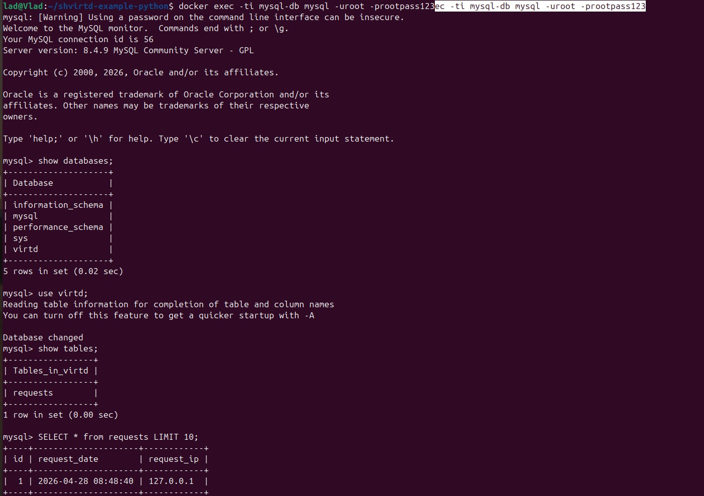

Задание 3 

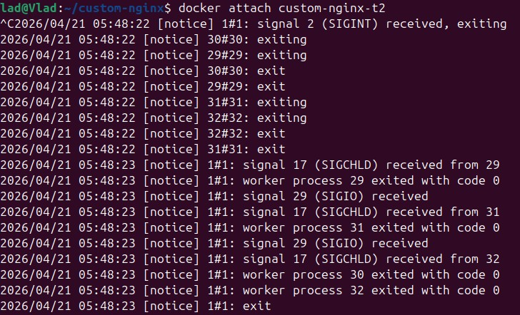

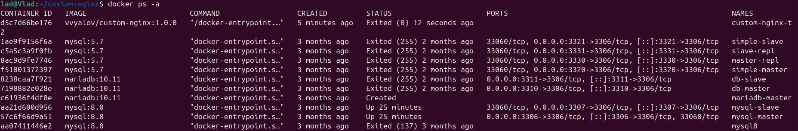

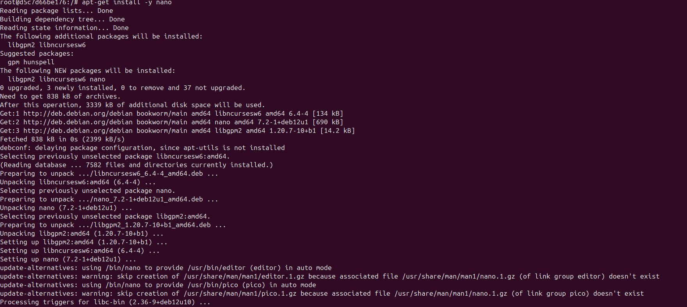

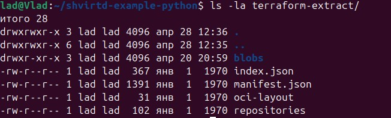

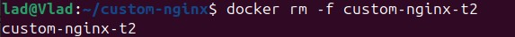

Задание 4

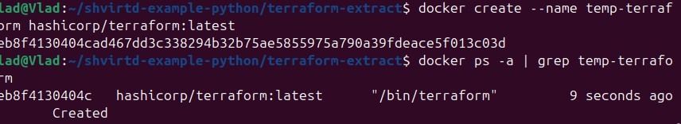

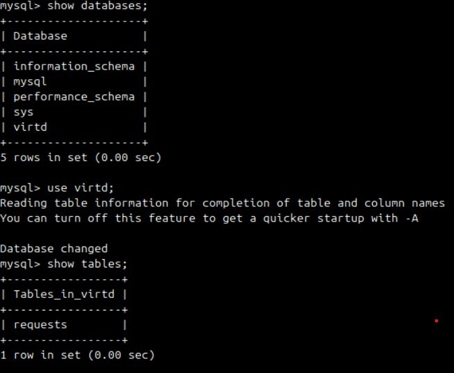

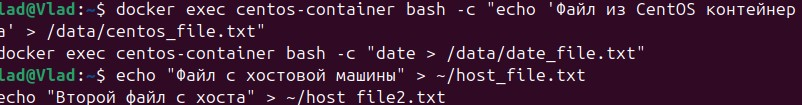

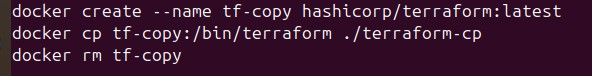

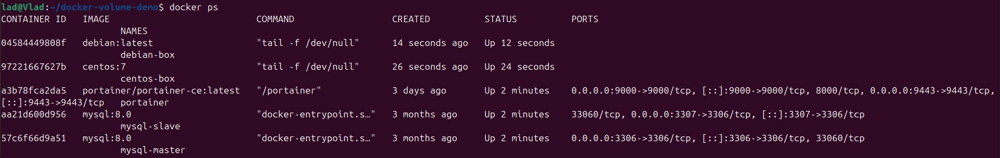

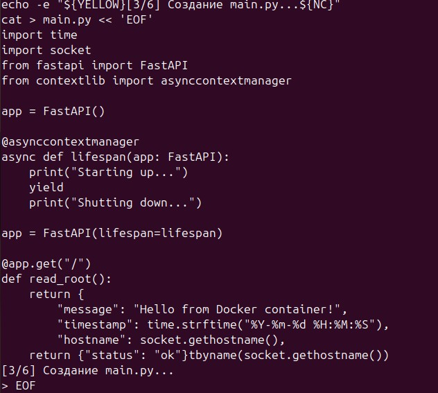

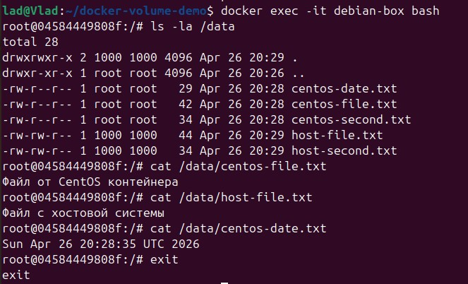

Задание 5

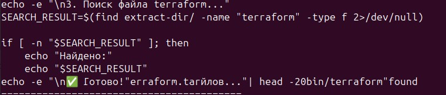

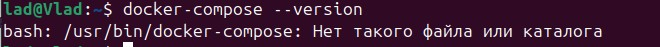

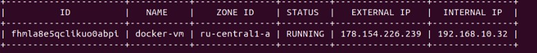

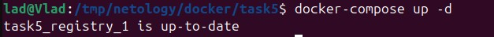