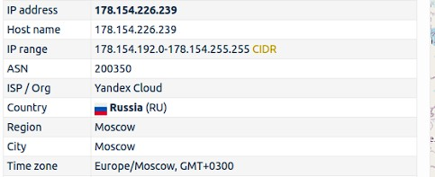
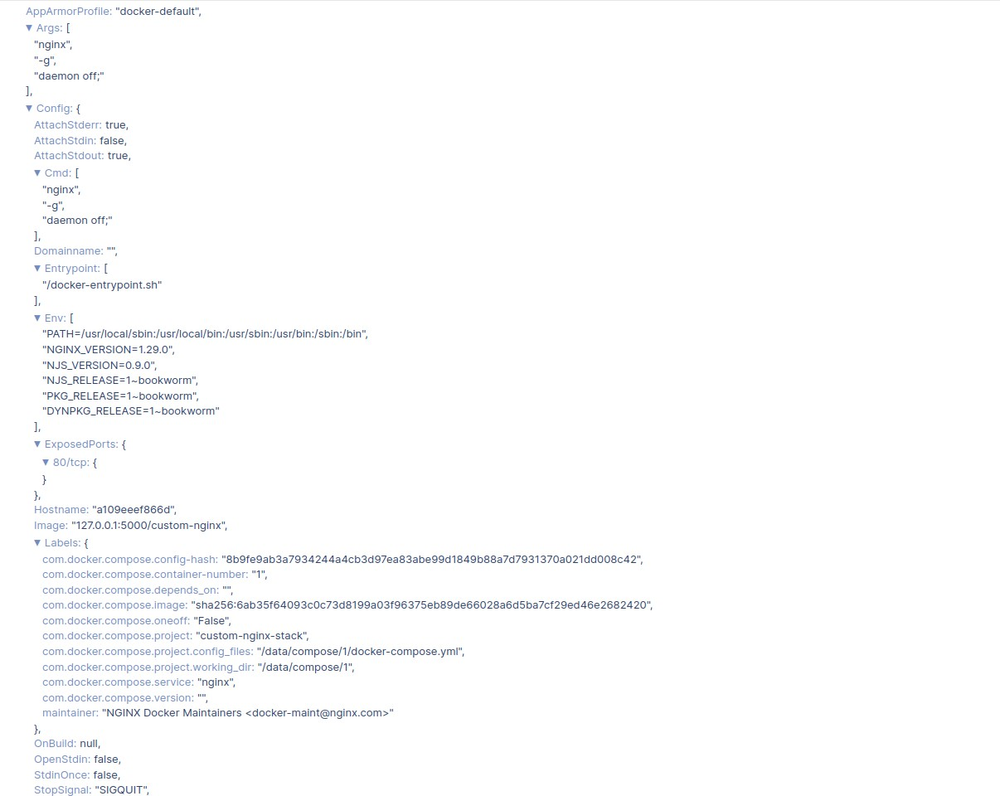

# Домашнее задание к занятию "Уязвимости и атаки на информационные системы" - `Вялов Владислав`

## Задание 0

## Задание 1

## Задание 3

## Задание 4 

https://github.com/vvyalov/shvirtd-example-python.git

## Задание 6

## Задание 6.1

